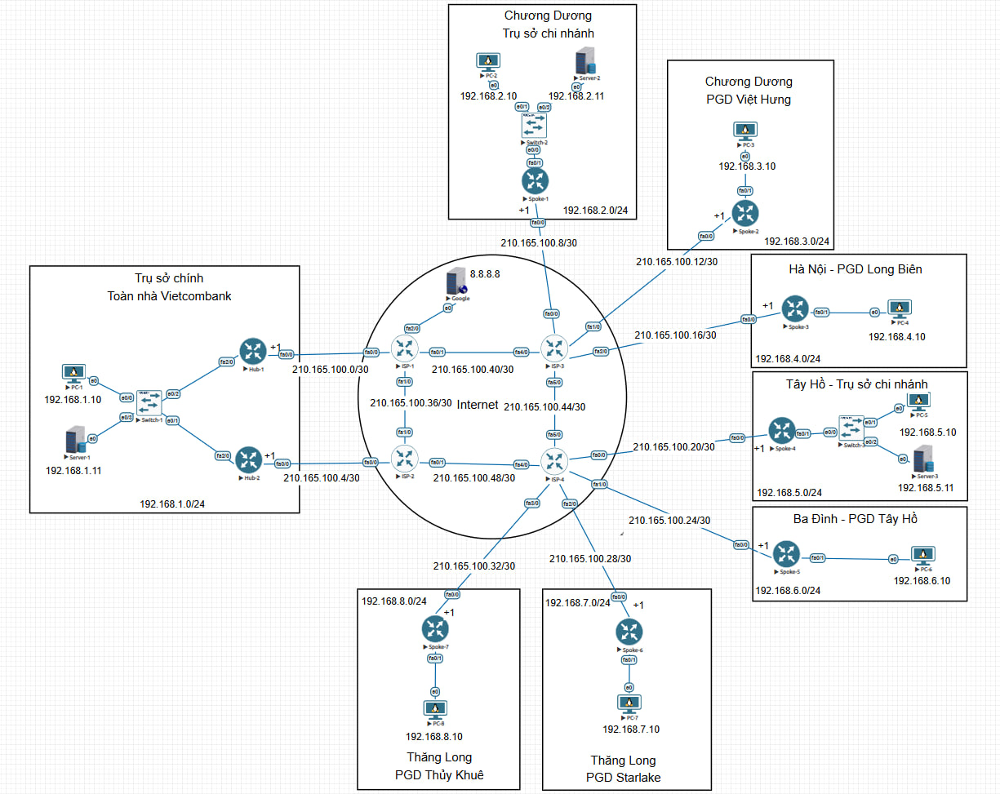

# Dự án DMVPN Dual Hub Single Cloud

Dự án này trình bày việc triển khai một mạng DMVPN (Dynamic Multipoint VPN) với kiến trúc **Dual Hub, Single Cloud**. Mục tiêu là xây dựng một hệ thống mạng an toàn, có khả năng mở rộng linh hoạt và độ sẵn sàng cao thông qua cơ chế dự phòng giữa hai Hub.

Giải pháp tích hợp các công nghệ then chốt bao gồm:
* **GRE (Generic Routing Encapsulation):** Để tạo đường hầm (tunnel) ảo.
* **IPsec:** Để mã hóa dữ liệu, đảm bảo tính bảo mật cho thông tin truyền qua tunnel.
* **NHRP (Next Hop Resolution Protocol):** Cho phép các Spoke tự động tìm thấy địa chỉ của các Spoke khác, hỗ trợ kết nối trực tiếp Spoke-to-Spoke.
* **OSPF (Open Shortest Path First):** Giao thức định tuyến nội bộ được sử dụng trong mạng DMVPN để trao đổi thông tin định tuyến giữa các Hub và Spoke.

Kết nối ra mạng ngoài (Internet) được quản lý bởi các ISP (Nhà cung cấp Dịch vụ Internet) sử dụng giao thức **RIP (Routing Information Protocol)**.

## Kiến trúc Mạng và Các Thành phần Chính



Kiến trúc tổng thể của dự án bao gồm các thành phần cốt lõi sau:

* **Trung tâm Điều phối (Hubs):**
    * Gồm hai router trung tâm (**Hub1** và **Hub2**), đóng vai trò là điểm hội tụ cho các kết nối DMVPN từ các chi nhánh (Spokes).
    * Cấu hình Dual Hub đảm bảo tính dự phòng và liên tục của mạng; nếu một Hub gặp sự cố, Hub còn lại sẽ tiếp quản.
* **Các Chi nhánh (Spokes):**
    * Là các router tại những địa điểm từ xa, đại diện cho các văn phòng chi nhánh.
    * Tự động thiết lập kết nối tunnel DMVPN an toàn về cả hai Hub.
* **Hạ tầng Mạng Nội bộ:**
    * **Thiết bị Đầu cuối (PCs và Servers):** Các máy tính cá nhân và máy chủ được cấu hình địa chỉ IP tĩnh và có một tuyến đường mặc định (default route) trỏ về router nội bộ (Spoke hoặc Switch) để truy cập mạng.
    * **Switches:** Các thiết bị chuyển mạch Layer 2 đơn giản, đảm bảo kết nối vật lý và phân đoạn mạng (VLAN) cho các thiết bị trong cùng một site.
* **Kết nối Mạng Ngoài:**
    * **Nhà cung cấp Dịch vụ Internet (ISPs):** Hai router mô phỏng vai trò của ISP, sử dụng RIP để quảng bá và học các tuyến đường mạng từ/đến mạng DMVPN và "Internet".
    * **Google Router:** Một router mô phỏng một điểm đến trên Internet (ví dụ: máy chủ DNS của Google) với địa chỉ IP `8.8.8.8`, được sử dụng để kiểm tra kết nối từ các thiết bị trong mạng DMVPN ra bên ngoài.

## Tệp Cấu hình

Phần tiếp theo trình bày chi tiết cấu hình cho từng thiết bị trong dự án.

### PCs

#### PC-1
```bash
enable
confing terminal 
hostbname PC-1
interface ethernet 0
ip addres 192.168.1.10 255.255.255.0
no shutgown
duplex full
exi
ip route 0.0.0.0 0.0.0.0 192.168.1.1
ip route 0.0.0.0 0.0.0.0 192.168.1.2
line vty 0 4
pass telnet
login
do wr
end
```

#### PC-2
```bash
en
conf t
ho PC-2
int e0
ip add 192.168.2.10 255.255.255.0
no shu
duplex full
exi
ip route 0.0.0.0 0.0.0.0 192.168.2.1
line vty 0 4
pass telnet
login
do wr
end
```

#### PC-3
```bash
en
conf t
ho PC-3
int e0
ip add 192.168.3.10 255.255.255.0
no shu
duplex full
exi
ip route 0.0.0.0 0.0.0.0 192.168.3.1
line vty 0 4
pass telnet
login
do wr
end
```

#### PC-4
```bash
en
conf t
ho PC-4
int e0
ip add 192.168.4.10 255.255.255.0
no shu
duplex full
exi
ip route 0.0.0.0 0.0.0.0 192.168.4.1
line vty 0 4
pass telnet
login
do wr
end
```

#### PC-5
```bash
en
conf t
ho PC-5
int e0
ip add 192.168.5.10 255.255.255.0
no shu
duplex full
exi
ip route 0.0.0.0 0.0.0.0 192.168.5.1
line vty 0 4
pass telnet
login
do wr
end
```

#### PC-6
```bash
en
conf t
ho PC-6
int e0
ip add 192.168.6.10 255.255.255.0
no shu
duplex full
exi
ip route 0.0.0.0 0.0.0.0 192.168.6.1
line vty 0 4
pass telnet
login
do wr
end
```

#### PC-7
```bash
en
conf t
ho PC-7
int e0
ip add 192.168.7.10 255.255.255.0
no shu
duplex full
exi
ip route 0.0.0.0 0.0.0.0 192.168.7.1
line vty 0 4
pass telnet
login
do wr
end
```

#### PC-8
```bash
en
conf t
ho PC-8
int e0
ip add 192.168.8.10 255.255.255.0
no shu
duplex full
exi
ip route 0.0.0.0 0.0.0.0 192.168.8.1
line vty 0 4
pass telnet
login
do wr
end
```

### Servers

#### Server-1
```bash
en
conf t
ho Server-1
int e0
ip add 192.168.1.11 255.255.255.0
no shu
duplex full
exi
ip route 0.0.0.0 0.0.0.0 192.168.1.1
ip route 0.0.0.0 0.0.0.0 192.168.1.2
line vty 0 4
pass telnet
login
do wr
end
```

#### Server-2
```bash
en
conf t
ho Server-2
int e0
ip add 192.168.2.11 255.255.255.0
no shu
duplex full
exi
ip route 0.0.0.0 0.0.0.0 192.168.2.1
line vty 0 4
pass telnet
login
do wr
end
```

#### Server-3
```bash
en
conf t
ho Server-3
int e0
ip add 192.168.5.11 255.255.255.0
no shu
duplex full
exi
ip route 0.0.0.0 0.0.0.0 192.168.5.1
line vty 0 4
pass telnet
login
do wr
end
```

### Switches

#### Switch-1
```bash
en
conf t
ho Switch-1
int e0/0
duplex full
no shut
int e0/1
duplex full
no shut
int e0/2
duplex full
no shut
int e0/3
duplex full
no shut
end
wr
```

#### Switch-2
```bash
en
conf t
ho Switch-2
int e0/0
duplex full
no shut
int e0/1
duplex full
no shut
int e0/2
duplex full
no shut
end
wr
```

#### Switch-3
```bash
en
conf t
ho Switch-3
int e0/0
duplex full
no shut
int e0/1
duplex full
no shut
int e0/2
duplex full
no shut
end
wr
```

### Hubs

#### Hub-1
```bash
en
conf t
ho Hub-1
int fa0/0
ip add 210.165.100.1 255.255.255.252
no shu
duplex full
int fa1/0
ip add 192.168.1.1 255.255.255.0
no shu
duplex full
exi
ip route 0.0.0.0 0.0.0.0 fa0/0

crypto isakmp policy 10
 encryption aes 256
 hash sha256
 authentication pre-share
 group 14
 lifetime 86400

crypto isakmp key DMVPN_KEY address 0.0.0.0

crypto ipsec transform-set DMVPN-TSET esp-aes 256 esp-sha256-hmac
 mode tunnel

crypto ipsec profile DMVPN-PROFILE
 set transform-set DMVPN-TSET

interface tunnel 100
ip address 10.0.0.1 255.255.255.0
ip nhrp authentication NHRP_KEY
ip nhrp map multicast dynamic
ip nhrp network-id 1
ip nhrp redirect
tunnel source fastEthernet0/0
tunnel mode gre multipoint
tunnel protection ipsec profile DMVPN-PROFILE
ip ospf network point-to-multipoint
ip ospf cost 10
no shutdown

Router ospf 1
router-id 1.1.1.1
Network 192.168.1.0 0.0.0.255 area 0
Network 10.0.0.0 0.0.0.255 area 0
end
wr
```

#### Hub-2
```bash
en
conf t
ho Hub-2
int fa0/0
ip add 210.165.100.5 255.255.255.252
no shu
duplex full
int fa1/0
ip add 192.168.1.2 255.255.255.0
no shu
duplex full
exi
ip route 0.0.0.0 0.0.0.0 fa0/0

crypto isakmp policy 10
 encryption aes 256
 hash sha256
 authentication pre-share
 group 14
 lifetime 86400

crypto isakmp key DMVPN_KEY address 0.0.0.0

crypto ipsec transform-set DMVPN-TSET esp-aes 256 esp-sha256-hmac
 mode tunnel

crypto ipsec profile DMVPN-PROFILE
 set transform-set DMVPN-TSET

interface tunnel 100
ip address 10.0.0.2 255.255.255.0
ip nhrp authentication NHRP_KEY
ip nhrp map multicast dynamic
ip nhrp network-id 1
ip nhrp redirect
tunnel source fastEthernet0/0
tunnel mode gre multipoint
ip nhrp map 10.0.0.1 210.165.100.1
ip nhrp map multicast 210.165.100.1
ip nhrp nhs 10.0.0.1
tunnel protection ipsec profile DMVPN-PROFILE
ip ospf network point-to-multipoint
ip ospf cost 20
no shutdown

Router ospf 1
router-id 2.2.2.2
Network 192.168.1.0 0.0.0.255 area 0
Network 10.0.0.0 0.0.0.255 area 0
end
wr
```

### Spokes

#### Spoke-1
```bash
en
conf t
ho Spoke-1
int fa0/0
ip add 210.165.100.9 255.255.255.252
no shu
duplex full
int fa1/0
ip add 192.168.2.1 255.255.255.0
no shu
duplex full
exi
ip route 0.0.0.0 0.0.0.0 fa0/0

crypto isakmp policy 10
 encryption aes 256
 hash sha256
 authentication pre-share
 group 14
 lifetime 86400

crypto isakmp key DMVPN_KEY address 0.0.0.0

crypto ipsec transform-set DMVPN-TSET esp-aes 256 esp-sha256-hmac
 mode tunnel

crypto ipsec profile DMVPN-PROFILE
 set transform-set DMVPN-TSET

interface tunnel 100
ip address 10.0.0.3 255.255.255.0
ip nhrp authentication NHRP_KEY
ip nhrp map 10.0.0.1 210.165.100.1
ip nhrp map 10.0.0.2 210.165.100.5
ip nhrp map multicast 210.165.100.1
ip nhrp map multicast 210.165.100.5
ip nhrp network-id 1
ip nhrp nhs 10.0.0.1 priority 1
ip nhrp nhs 10.0.0.2 priority 5
ip nhrp shortcut
ip nhrp registration timeout 60
ip nhrp holdtime 300 
tunnel source fastEthernet0/0
tunnel mode gre multipoint
tunnel protection ipsec profile DMVPN-PROFILE
ip ospf network point-to-multipoint
no shutdown

Router ospf 1
router-id 3.3.3.3
Network 192.168.2.0 0.0.0.255 area 0
Network 10.0.0.0 0.0.0.255 area 0
end
wr
```

#### Spoke-2
```bash
en
conf t
ho Spoke-2
int fa0/0
ip add 210.165.100.13 255.255.255.252
no shu
duplex full
int fa1/0
ip add 192.168.3.1 255.255.255.0
no shu
duplex full
exi
ip route 0.0.0.0 0.0.0.0 fa0/0

crypto isakmp policy 10
 encryption aes 256
 hash sha256
 authentication pre-share
 group 14
 lifetime 86400

crypto isakmp key DMVPN_KEY address 0.0.0.0

crypto ipsec transform-set DMVPN-TSET esp-aes 256 esp-sha256-hmac
 mode tunnel

crypto ipsec profile DMVPN-PROFILE
 set transform-set DMVPN-TSET

interface tunnel 100
ip address 10.0.0.4 255.255.255.0
ip nhrp authentication NHRP_KEY
ip nhrp map 10.0.0.1 210.165.100.1
ip nhrp map 10.0.0.2 210.165.100.5
ip nhrp map multicast 210.165.100.1
ip nhrp map multicast 210.165.100.5
ip nhrp network-id 1
ip nhrp nhs 10.0.0.1 priority 1
ip nhrp nhs 10.0.0.2 priority 5
ip nhrp shortcut
ip nhrp registration timeout 60
ip nhrp holdtime 300 
tunnel source fastEthernet0/0
tunnel mode gre multipoint
tunnel protection ipsec profile DMVPN-PROFILE
ip ospf network point-to-multipoint
no shutdown

Router ospf 1
router-id 4.4.4.4
Network 192.168.3.0 0.0.0.255 area 0
Network 10.0.0.0 0.0.0.255 area 0
end
wr
```

#### Spoke-3
```bash
en
conf t
ho Spoke-3
int fa0/0
ip add 210.165.100.17 255.255.255.252
no shu
duplex full
int fa1/0
duplex full
ip add 192.168.4.1 255.255.255.0
no shu
exi
ip route 0.0.0.0 0.0.0.0 fa0/0

crypto isakmp policy 10
 encryption aes 256
 hash sha256
 authentication pre-share
 group 14
 lifetime 86400

crypto isakmp key DMVPN_KEY address 0.0.0.0

crypto ipsec transform-set DMVPN-TSET esp-aes 256 esp-sha256-hmac
 mode tunnel

crypto ipsec profile DMVPN-PROFILE
 set transform-set DMVPN-TSET

Interface tunnel 100
Ip address 10.0.0.5 255.255.255.0
ip nhrp authentication NHRP_KEY
ip nhrp map 10.0.0.1 210.165.100.1
ip nhrp map 10.0.0.2 210.165.100.5
ip nhrp map multicast 210.165.100.1
ip nhrp map multicast 210.165.100.5
ip nhrp network-id 1
ip nhrp nhs 10.0.0.1 priority 1
ip nhrp nhs 10.0.0.2 priority 5
ip nhrp shortcut
ip nhrp registration timeout 60
ip nhrp holdtime 300 
tunnel source fastEthernet0/0
tunnel mode gre multipoint
tunnel protection ipsec profile DMVPN-PROFILE
ip ospf network point-to-multipoint
no shutdown

Router ospf 1
router-id 5 RADIUS Authentication and Accounting
Network 192.168.4.0 0.0.0.255 area 0
Network 10.0.0.0 0.0.0.255 area 0
end
wr
```

#### Spoke-4
```bash
en
conf t
ho Spoke-4
int fa0/0
ip add 210.165.100.21 255.255.255.252
no shu
duplex full
int fa1/0
ip add 192.168.5.1 255.255.255.0
no shu
duplex full
exi
ip route 0.0.0.0 0.0.0.0 fa0/0

crypto isakmp policy 10
 encryption aes 256
 hash sha256
 authentication pre-share
 group 14
 lifetime 86400

crypto isakmp key DMVPN_KEY address 0.0.0.0

crypto ipsec transform-set DMVPN-TSET esp-aes 256 esp-sha256-hmac
 mode tunnel

crypto ipsec profile DMVPN-PROFILE
 set transform-set DMVPN-TSET

Interface tunnel 100
Ip address 10.0.0.6 255.255.255.0
ip nhrp authentication NHRP_KEY
ip nhrp map 10.0.0.1 210.165.100.1
ip nhrp map 10.0.0.2 210.165.100.5
ip nhrp map multicast 210.165.100.1
ip nhrp map multicast 210.165.100.5
ip nhrp network-id 1
ip nhrp nhs 10.0.0.1 priority 1
ip nhrp nhs 10.0.0.2 priority 5
ip nhrp shortcut
ip nhrp registration timeout 60
ip nhrp holdtime 300 
tunnel source fastEthernet0/0
tunnel mode gre multipoint
tunnel protection ipsec profile DMVPN-PROFILE
ip ospf network point-to-multipoint
no shutdown

Router ospf 1
router-id 6.6.6.6
Network 192.168.5.0 0.0.0.255 area 0
Network 10.0.0.0 0.0.0.255 area 0
end
wr
```

#### Spoke-5
```bash
en
conf t
ho Spoke-5
int fa0/0
ip add 210.165.100.25 255.255.255.252
no shu
duplex full
int fa1/0
ip add 192.168.6.1 255.255.255.0
no shu
duplex full
exi
ip route 0.0.0.0 0.0.0.0 fa0/0

crypto isakmp policy 10
 encryption aes 256
 hash sha256
 authentication pre-share
 group 14
 lifetime 86400

crypto isakmp key DMVPN_KEY address 0.0.0.0

crypto ipsec transform-set DMVPN-TSET esp-aes 256 esp-sha256-hmac
 mode tunnel

crypto ipsec profile DMVPN-PROFILE
 set transform-set DMVPN-TSET

Interface tunnel 100
Ip address 10.0.0.7 255.255.255.0
ip nhrp authentication NHRP_KEY
ip nhrp map 10.0.0.1 210.165.100.1
ip nhrp map 10.0.0.2 210.165.100.5
ip nhrp map multicast 210.165.100.1
ip nhrp map multicast 210.165.100.5
ip nhrp network-id 1
ip nhrp nhs 10.0.0.1 priority 1
ip nhrp nhs 10.0.0.2 priority 5
ip nhrp shortcut
ip nhrp registration timeout 60
ip nhrp holdtime 300 
tunnel source fastEthernet0/0
tunnel mode gre multipoint
tunnel protection ipsec profile DMVPN-PROFILE
ip ospf network point-to-multipoint
no shutdown

Router ospf 1
router-id 7.7.7.7
Network 192.168.6.0 0.0.0.255 area 0
Network 10.0.0.0 0.0.0.255 area 0
end
wr
```

#### Spoke-6
```bash
en
conf t
ho Spoke-6
int fa0/0
ip add 210.165.100.29 255.255.255.252
no shu
duplex full
int fa1/0
ip add 192.168.7.1 255.255.255.0
no shu
duplex full
exi
ip route 0.0.0.0 0.0.0.0 fa0/0

crypto isakmp policy 10
 encryption aes 256
 hash sha256
 authentication pre-share
 group 14
 lifetime 86400

crypto isakmp key DMVPN_KEY address 0.0.0.0

crypto ipsec transform-set DMVPN-TSET esp-aes 256 esp-sha256-hmac
 mode tunnel

crypto ipsec profile DMVPN-PROFILE
 set transform-set DMVPN-TSET

Interface tunnel 100
Ip address 10.0.0.8 255.255.255.0
ip nhrp authentication NHRP_KEY
ip nhrp map 10.0.0.1 210.165.100.1
ip nhrp map 10.0.0.2 210.165.100.5
ip nhrp map multicast 210.165.100.1
ip nhrp map multicast 210.165.100.5
ip nhrp network-id 1
ip nhrp nhs 10.0.0.1 priority 1
ip nhrp nhs 10.0.0.2 priority 5
ip nhrp shortcut
ip nhrp registration timeout 60
sip holdtime 300 
tunnel source fastEthernet0/0
tunnel mode gre multipoint
tunnel protection ipsec profile DMVPN-PROFILE
ip ospf network point-to-multipoint
no shutdown

Router ospf 1
router-id 8.8.8.8
Network 192.168.7.0 0.0.0.255 area 0
Network 10.0.0.0 0.0.0.255 area 0
end
wr
```

#### Spoke-7
```bash
en
conf t
ho Spoke-7
int fa0/0
ip add 210.165.100.33 255.255.255.252
no shu
duplex full
int fa1/0
ip add 192.168.8.1 255.255.255.0
no shu
duplex full
exi
ip route 0.0.0.0 0.0.0.0 fa0/0

crypto isakmp policy 10
 encryption aes 256
 hash sha256
 authentication pre-share
 group 14
 lifetime 86400

crypto isakmp key DMVPN_KEY address 0.0.0.0

crypto ipsec transform-set DMVPN-TSET esp-aes 256 esp-sha256-hmac
 mode tunnel

crypto ipsec profile DMVPN-PROFILE
 set transform-set DMVPN-TSET

Interface tunnel 100
Ip address 10.0.0.9 255.255.255.0
ip nhrp authentication NHRP_KEY
ip nhrp map 10.0.0.1 210.165.100.1
ip nhrp map 10.0.0.2 210.165.100.5
ip nhrp map multicast 210.165.100.1
ip nhrp map multicast 210.165.100.5
ip nhrp network-id 1
ip nhrp nhs 10.0.0.1 priority 1
ip nhrp nhs 10.0.0.2 priority 5
ip nhrp shortcut
ip nhrp registration timeout 60
ip nhrp holdtime 300 
tunnel source fastEthernet0/0
tunnel mode gre multipoint
tunnel protection ipsec profile DMVPN-PROFILE
ip ospf network point-to-multipoint
no shutdown

Router ospf 1
router-id 9.9.9.9
Network 192.168.8.0 0.0.0.255 area 0
Network 10.0.0.0 0.0.0.255 area 0
end
wr
```

### ISPs

#### ISP-1
```bash
en
conf t
ho ISP-1
int fa0/0
ip add 210.165.100.2 255.255.255.252
no shu
speed 100
duplex full
int fa0/1
ip add 210.165.100.41 255.255.255.252
no shu
speed 100
duplex full
int fa1/0
ip add 210.165.100.37 255.255.255.252
no shu
speed 100
duplex full
int fa2/0
ip add 8.8.8.1 255.255.255.0
no shu
speed 100
duplex full
exi
no router ospf 1
router rip
ver 2
no au
pass fa0/0
network 210.165.100.0 
network 210.165.100.36 
network 210.165.100.40 
network 8.8.8.0  
do wr
```

#### ISP-2
```bash
en
conf t
ho ISP-2
int fa0/0
ip add 210.165.100.6 255.255.255.252
no shu
speed 100
duplex full
int fa0/1
ip add 210.165.100.49 255.255.255.252
no shu
speed 100
duplex full
int fa1/0
ip add 210.165.100.38 255.255.255.252
no shu
speed 100
duplex full
exi
no router ospf 1
router rip
ver 2
no au
pass fa0/0
network 210.165.100.4 
network 210.165.100.36 
network 210.165.100.48 
do wr
```

#### ISP-3
```bash
en
conf t
ho ISP-3
int fa0/0
ip add 210.165.100.10 255.255.255.252
no shu
duplex full
int fa4/0
ip add 210.165.100.42 255.255.255.252
no shu
duplex full
int fa5/0
ip add 210.165.100.45 255.255.255.252
no shu
duplex full
int fa1/0
ip add 210.165.100.14 255.255.255.252
no shu
duplex full
int fa2/0
ip add 210.165.100.18 255.255.255.252
no shu
duplex full
exi
no router ospf 1
router rip
ver 2
no au
pass fa0/0
network 210.165.100.8 
network 210.165.100.12 
network 210.165.100.16 
network 210.165.100.40 
network 210.165.100.44 
do wr
```

#### ISP-4
```bash
en
conf t
ho ISP-4
int fa0/0
ip add 210.165.100.22 255.255.255.252
no shu
duplex full
int fa4/0
ip add 210.165.100.50 255.255.255.252
no shu
duplex full
int fa5/0
ip add 210.165.100.46 255.255.255.252
no shu
duplex full
int fa1/0
ip add 210.165.100.26 255.255.255.252
no shu
duplex full
int fa2/0
ip add 210.165.100.30 255.255.255.252
no shu
duplex full
int fa3/0
ip add 210.165.100.34 255.255.255.252
no shu
duplex full
exi
no router ospf 1
router rip
ver 2
no au
pass fa0/0
network 210.165.100.20 
network 210.165.100.24 
network 210.165.100.28 
network 210.165.100.32 
network 210.165.100.44 
network 210.165.100.48 
do wr
```

### Google Router
```bash
en
conf t 
ho google
int e0 
ip add 8.8.8.8 255.255.255.0
no shu
duplex full
exit
ip route 0.0.0.0 0.0.0.0 8.8.8.1
end 
wr
```

## Hướng dẫn Cài đặt

1.  **Cấu hình Thiết bị**: Áp dụng các cấu hình cho từng thiết bị tương ứng bằng trình giả lập tương thích Cisco IOS hoặc phần cứng.
2.  **Xác minh Kết nối**: Đảm bảo tất cả các giao diện đều hoạt động (lệnh `no shutdown`).
3.  **Kiểm tra DMVPN**: Xác minh việc thiết lập tunnel và ánh xạ NHRP bằng các lệnh như `show dmvpn` và `show ip nhrp`.
4.  **Kiểm tra Định tuyến**: Xác nhận bảng định tuyến OSPF và RIP bằng lệnh `show ip route`.
5.  **Kiểm tra Telnet**: Xác minh quyền truy cập telnet vào các máy tính cá nhân (PC) và máy chủ bằng mật khẩu đã cấu hình.

## Lưu ý

-   Thay thế `DMVPN_KEY` và `NHRP_KEY` bằng các khóa bảo mật trong môi trường sản xuất.
-   Đảm bảo tính nhất quán của ID router OSPF và cấu hình vùng (area).
-   Các cấu hình này giả định các giao diện hoạt động ở chế độ song công toàn phần (full-duplex) để đạt hiệu suất tối ưu.

## Giấy phép

Dự án này được cấp phép theo Giấy phép MIT.